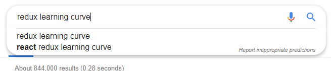

# React에 관한 개인적 생각

### 개요

이 글은 2019년 4월 기준 구직 중인 고등학생 웹 프론트엔드 개발자가 주관적으로 바라본 React에 관한 생각입니다. 현재 React/Redux를 배우고 있으며, 전문가처럼 잘 하진 못합니다 :)


### 프롤로그

저는 2017년에 SW 마이스터 고등학교에 입학하여 제 주 분야를 약 반 년간 찾아다녔습니다. 계속 찾아보다가 저의 손에 잡히게 된 건 **웹 개발**이었고 그에 관해 하나하나씩 공부하게 되었습니다.

그러다가 대구시 지방기능경기대회에 웹디자인 및 개발 직종으로 참가하고 5등이라는 결과를 받게 되었습니다. 저는 기능반 생활을 하며 외우다시피 배운 **jQuery**를 정말 싫어했습니다.

안 그래도 기능대회에 출전하기 전부터 저는 혼자 Vue.js를 열심히 배우고 있었고, 기능경기대회를 마무리하고 진행하는 첫 프로젝트부터 마지막 프로젝트까지 프로젝트 하나를 제외하고 Vue.js를 사용하게 되었습니다. 이렇게 저는 약 1년 반 동안 **Vue.js를 주로 사용**했습니다.

3학년이 되고 구직 활동을 하면서 코딩테스트를 하게 되었고 이 테스트를 Vue.js로 치루게 되었습니다. 테스트 이후 저는 코딩테스트를 실시한 회사의 권유와 앞으로의 장래를 위하여 **React/Redux**를 배우게 되었습니다.


### Vue.js에서 React로 넘어오기

저는 React를 본격적으로 시작하기 전, 편견을 가지고 있었습니다.

> 솔직히 React보단 Vue.js가 훨씬 쉬워요!

결론부터 말하자면, **둘 다 비슷합니다**. 단지 문법과 사용 함수가 달랐을 뿐, 둘은 웹 프론트엔드 개발을 하는 데 큰 차이점이 없었습니다.

```javascript
class App extends React.Component {
  render() {
    return (
      <p>Hello world!</p>
    );
  }
}

ReactDOM.render(<App />, document.getElementById("app"));
```

```javascript
const App = new Vue({
  el: "#app",
  render: h => h("p", "Hello world");
});
```

> 이외에도 서로 대부분의 기능이 서로에게 있습니다.

그래서 딱히 React로 넘어왔을 때의 **문제점은 없었습니다**.


### CSS

솔직히 말해서, `Single File Component`를 사용하는 Vue.js와 달리 React는 CSS를 작성할 때 큰 고민을 안게 되었습니다.

- `styled-components`: 다양한 SASS 기반 라이브러리 활용 불가, 하지만 매우 편한 CSS 작성 가능
- `classnames + node-sass`: CSS를 작성하는 게 `styled-components` 보단 불편함. 하지만 다양한 SASS 기반 라이브러리 활용 가능

사실 이 셋의 장점만 골라서 쓰고 싶은데, 이제 막 React를 처음 시작한 고등학생 개발자에게는 어려운 일이었습니다.

결국 저는 `styled-components`를 주로 사용하고, 또 열심히 공부하고 있습니다. React에서 스타일을 다루는 일은 **조금 고민도 되고 까다로웠던 것 같습니다**.


### Redux 그리고 상태 관리

상태 관리 라이브러리로 Redux를 처음 접하게 되었습니다. 제가 주위에서 들은 소문대로 Redux는 초보자에게 아무런 자비가 없었습니다.


> redux learning curve가 검색어로 검색이 될 만큼 높은 러닝 커브를 가지고 있는 듯 합니다.

결국 반복된 연습만이 Redux를 마스터할 수 있는 길이라고 판단하고 항상 연습하기로 결심했습니다. 독자분이 React에서 상태 관리 라이브러리로 꼭 Redux를 배워와야 하는 입장이 아니라면 저는 Redux보단 **MobX를 추천**합니다.

> 주: 저도 MobX를 사용해보지는 않았으나, 기회가 닿는다면 배울 예정입니다.

그래도 **잘 사용하기만 한다면 정말 대단한 라이브러리**라고 생각합니다. 우리가 생각하는 것보다 많은 일을 하게 해 주고, Redux 기반으로 나온 유틸리티성 라이브러리들 (이를테면 redux-actions 같은 라이브러리) 의 도움으로 어느 정도 부담을 덜어낼 수 있었습니다.


### 에필로그와 React 총평

React 자체는 정말 사용하기 쉽고 편합니다. 웹 프론트엔드 개발의 지침서 혹은 이정표 역할을 하기에 충분한 역량을 지니고 있다고 생각합니다.

하지만 이에 대해 아무런 경험이 없다면 Vue.js가 자칫 더욱 쉬워보일 수 있습니다. 이는 **지극히 정상적**이며 앞에서 설명했듯 저도 그랬습니다.

Vue.js는 Single File Component 기능, Vuex라는 상태 관리 라이브러리, Vue Router라는 라우터 등이 Vue 측에서 만들어 제공하는 기능입니다.

반면에 React는 React를 제외한 대부분이 외부 라이브러리이며, 이 라이브러리들을 자유롭게 조합해서 사용할 수 있습니다. 쉽게 배우려면 쉬운 라이브러리를, 심도 있게 배우려면 심도 있는 라이브러리를 선택함으로써 난이도도 자유롭습니다.

저는 이 높은 **자유도** 때문에 React를 좋아하게 되었습니다. 매 프로젝트마다 새로운 것을 사용하며 배우는 재미를 통해 눈에 보이는 성장이 저에게는 너무 매력적으로 다가왔습니다.

앞으로 웹 프론트엔드 개발을 하게 되면, 저는 React를 택하겠습니다. :)
